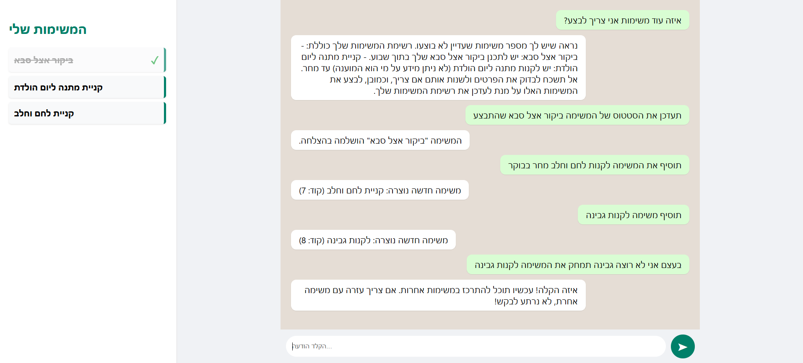

# 📝 Todo Agent - AI Full-Stack Assistant

אפליקציית ניהול משימות חכמה המשלבת סוכן AI (LLM) עם ממשק משתמש מודרני בסגנון WhatsApp. הסוכן מבין שפה חופשית, מנהל את המשימות ומעדכן את הממשק בזמן אמת.

## 🚀 יכולות האפליקציה
* **צ'אט אינטואיטיבי:** ניהול משימות דרך שיחה חופשית (הוספה, מחיקה, עדכון).
* **סנכרון ויזואלי:** רשימת משימות צדדית המתעדכנת אוטומטית בכל פעם שהסוכן מבצע פעולה.
* **סימון הצלחה:** משימות שבוצעו מסומנות בקו מוחק וב-**✓** ירוק בולט.
* **עיצוב מודרני:** ממשק נקי בהשראת WhatsApp עם בועות דיבור צבעוניות.

## 🛠 טכנולוגיות
### Backend (המוח)
* **Python & FastAPI:** שרת מהיר לניהול ה-API.
* **Groq API (Llama 3.3):** מנוע ה-AI שמבין את בקשות המשתמש.
* **LangChain:** לניהול לוגיקת הסוכן והכלים (Tools).

### Frontend (הממשק)
* **React.js:** בניית רכיבים דינמיים וניהול המצב (State).
* **CSS3:** עיצוב מותאם אישית (Custom UI).

## 📁 מבנה הפרויקט
* 📂 `backend/` - שרת הפייתון ולוגיקת ה-AI.
* 📂 `frontend/` - אפליקציית ה-React והעיצוב.

## 🏃 הוראות הרצה

### 1. הרצת ה-Backend
פתח טרמינל בתיקיית ה-`backend`:
```bash
# הפעלת הסביבה הווירטואלית
.\venv\Scripts\activate

# הרצת השרת
uvicorn main:app --reload
```
השרת ירוץ בכתובת: http://localhost:8000


### 2. הרצת ה-Frontend
פתח טרמינל (נוסף) בתיקיית ה-`frontend`:

```bash
# התקנת התלויות (בפעם הראשונה בלבד)
npm install

# הרצת האפליקציה
npm start
```
הממשק ייפתח בכתובת: http://localhost:3000


## 📸 צילום מסך


---
**פותח כפרויקט Full-Stack המשלב בינה מלאכותית (AI Agents).**